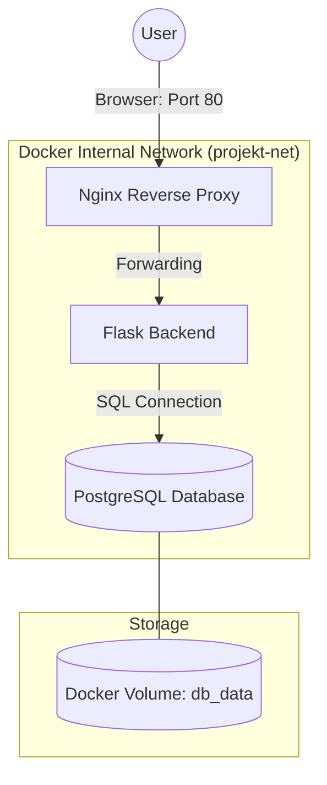

# Containerized Notes Manager

A lightweight, containerized To-Do List application built with **Python Flask**, **PostgreSQL**, and **Nginx**. This project demonstrates core containerization concepts including network isolation, data persistence, and orchestration.

## Architecture
The application consists of three Docker containers managed via Docker Compose:

1.  **Reverse Proxy (Nginx):** Acts as the gateway, exposing the application on port `80`.
2.  **Backend (Python Flask):** Handles application logic and CRUD operations. Isolated within an internal network (no direct external access).
3.  **Database (PostgreSQL):** Persists data using Docker volumes. Includes a healthcheck mechanism to ensure availability before the backend starts.


##  Key Features implemented
* **Network Isolation:** Custom bridge network (`projekt-net`) ensures the backend is only accessible via the Nginx proxy.
* **Data Persistence:** Docker Volumes preserve database records even after containers are removed.
* **Healthchecks:** The backend service waits for the database to be fully ready (`pg_isready`) using `depends_on`.
* **Security:** Environment variables are loaded from a `.env` file (not included in the repo for security).
* **CRUD Operations:** Users can create, read, and delete notes via a web interface.

##  Prerequisites
* Docker & Docker Compose

##  How to Run

1.  **Clone the repository** (or download source code).
2.  **Configure Environment Variables:**
    Create a `.env` file in the root directory based on the example:
    ```bash
    cp .env.example .env
    ```
    *(Fill in your own DB_USER and DB_PASSWORD inside .env)*

3.  **Launch the Application:**
    ```bash
    docker compose up -d --build
    ```

4.  **Access the App:**
    Open your browser and navigate to: [http://localhost](http://localhost)

##  Stopping the App
To stop containers and remove networks:
```bash
docker compose down
```
## Useful Docker Commands (Cheat Sheet)

Referencing lecture materials (Slide 281), here are the commands used to manage this project:

| Task | Docker Command |
| :--- | :--- |
| **Build & Run** | `docker compose up -d --build` |
| **List Containers** | `docker compose ps` |
| **Check Logs** | `docker compose logs -f` |
| **Inspect Network** | `docker network inspect projekt_wik_projekt-net` |
| **Database Access** | `docker exec -it projekt_wik-db-1 psql -U uzytkownik -d moja_baza` |
| **Stop & Cleanup** | `docker compose down -v` |

## Technical Details

### Healthcheck Mechanism
The database container uses a `pg_isready` healthcheck. The backend service includes a `depends_on` condition:
- It waits until the database is **Healthy** before starting.
- This prevents "Connection Refused" errors during the initial boot-up phase.

### Data Persistence
We use a **Named Volume** (`db_data`). Even if the containers are destroyed and recreated, the database records remain safe on the host machine in the Docker-managed storage area.